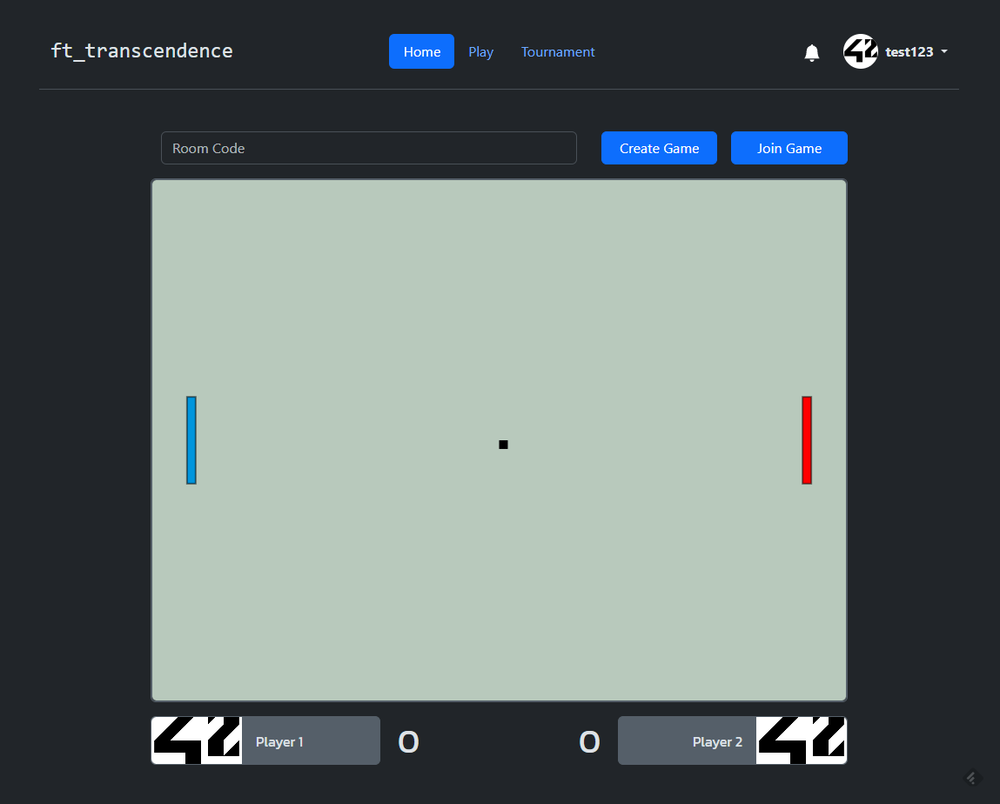

# ft_transcendence

Updated: 2024/01/18



## Conventions

### Formats

#### Frontend

-   Frontend codes should be formatted with `Prettier`.
-   Frontend is served directly through `nginx`.
-   Functions should be documented and typed with [JSDoc](https://www.jsdoc.app/).
-   Any large components should be encapsulated as WebComponent.

#### Backend

-   Backend codes should be formatted with `Ruff`.

### Commits

-   Commit messages should be done according to [Conventional Commits](https://www.conventionalcommits.org/en/v1.0.0/) specifications.

## Development

### Local Development

#### Requirements

-   Docker

#### Test Server

-   Run nginx

```shell
make run-nginx
```

-   Run backend server

```shell
make backend
```

-   Website should be accessible on `localhost`

## Objectives

### Mandatory

-   [x] Major module: Use a Framework as backend
-   [x] Minor module: Use a database for the backend
-   [x] Minor module: Use a front-end framework or toolkit
-   [ ] Major module: Standard user management, authentication, users across
        tournaments
-   [ ] Major module: Implementing a remote authentication
-   [x] Major module: Remote players
-   [ ] Major module: Live Chat
-   [ ] Major module: Implement Two-Factor Authentication (2FA) and JWT
-   [x] Major module: Infrastructure Setup with ELK
-   [x] Minor module: Monitoring system
-   [ ] Major module: Replacing Basic Pong with Server-Side Pong and Implementing an API
-   [x] Major module: Implementing Advanced 3D Techniques

**Total**: 8 Major Modules + 3 Minor Modules

### Optional

-   [ ] Major module: Add Another Game with User History and Matchmaking.
-   [ ] Major module: Designing the Backend as Microservices
